# Projeto de DB usando PHP e MySQL

Iremos usar o Apache (servidor), PHP (backend), MySQL (DBMS) e PHPMyAdmin (ferramenta DBA) para criar uma aplicação que usa bancos de dados relacionais. Para isso iremos precisar da ferramenta XAMPP (que ja deve estar instalada em sua máquina).
## 0.0. Sumário
- [Projeto de DB usando PHP e MySQL](#projeto-de-db-usando-php-e-mysql)
  - [0.0. Sumário](#00-sumário)
  - [0.1. Instalação do BrModelo](#01-instalação-do-brmodelo)
  - [0.2. Instalação e configuração do XAMPP (se a maquina não possui o XAMPP)](#02-instalação-e-configuração-do-xampp-se-a-maquina-não-possui-o-xampp)
  - [1. Instalação do Composer (gerenciador de dependências do PHP)](#1-instalação-do-composer-gerenciador-de-dependências-do-php)
  - [2. Instalação e configuração da IDE VsCode](#2-instalação-e-configuração-da-ide-vscode)
  - [3. Iniciando os serviços do XAMPP (Apache e MySQL)](#3-iniciando-os-serviços-do-xampp-apache-e-mysql)
  - [4. Criando um projeto dentro do servidor Apache do XAMPP](#4-criando-um-projeto-dentro-do-servidor-apache-do-xampp)

## 0.1. Instalação do BrModelo

1. Clique no link **<a target="_blank" href="https://sourceforge.net/projects/brmodelo/files/latest/download">https://sourceforge.net/projects/brmodelo/files/latest/download</a>** para baixar e instalar a versão mais nova do BrModelo.

2. Salve esse arquivo em sua Area de Trabalho. Clique nele duas vezes para abrir o BrModelo. Quando fizer isso você verá a seguinte tela. Nela, se você clicar no menu "Arquivo" -> "Novo" voce poderá criar um projeto conceitual ou logico de Banco de Dados. Iremos ver como fazer isso mais a frente no tutorial. Continue seguindo o passo-a-passo abaixo.

    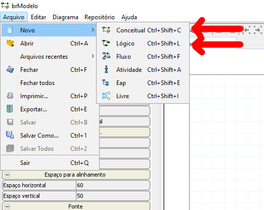


## 0.2. Instalação e configuração do XAMPP (se a maquina não possui o XAMPP)

1. Clique no link **<a target="_blank" href="https://sourceforge.net/projects/xampp/files/latest/download">https://sourceforge.net/projects/xampp/files/latest/download</a>** para baixar e instalar a versão mais nova do XAMPP.

    > - Se lembre que o XAMPP **SEMPRE** deve ser instalado no diretorio **C:\xampp**
    > - Caso voce tenha problemas na instalacão do XAMPP (ex: não tem permissão de Administrador no PC), voce pode instalar a versão portatil dele atraves do link **<a target="_blank" href="https://sourceforge.net/projects/xampp/files/XAMPP%20Windows/8.2.12/xampp-portable-windows-x64-8.2.12-0-VS16.zip/download">https://sourceforge.net/projects/xampp/files/XAMPP%20Windows/8.2.12/xampp-portable-windows-x64-8.2.12-0-VS16.zip/download</a>**. Nesse caso, abra o arquivo .ZIP e copie tudo para sua Area de Trabalho (vide printscreens abaixo). Isto é, extraia o arquivo .ZIP para a Area de Trabalho. Após isso o XAMPP pode ser executado através do programa **``xampp-control.exe``**

    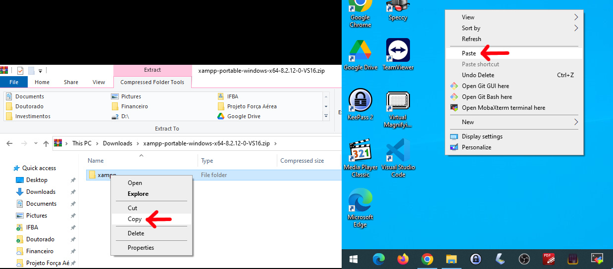

## 1. Instalação do Composer (gerenciador de dependências do PHP)

1. Baixe e instale o Composer nesse link <a target="_blank" href="https://getcomposer.org/Composer-Setup.exe">https://getcomposer.org/Composer-Setup.exe</a>

2. Durante a instalação o Composer ira lhe pedir onde esta o executável do PHP (php.exe).  Selecione a pasta ``php/php.exe``, marque a opção "Add this PHP to your path" e clique em "Next". Clique em "Next" novamente.
    
    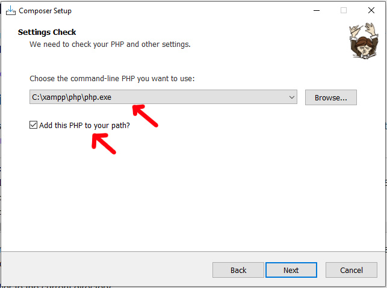

3. Teste se o composer esta funcionando digitando "composer" no terminal do windows (cmd.exe). Veja printscreen abaixo.

    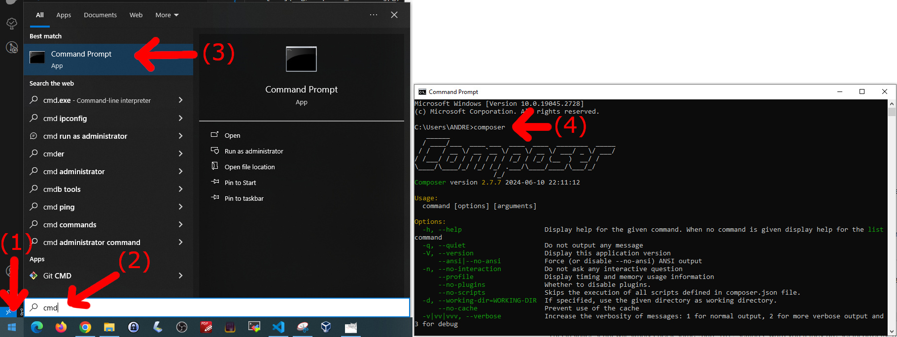

4. Agora ja podemos instalar as dependências dos nossos projetos usando o "composer". Para isso abra o terminal do Windows (cmd.exe). Em seguida digite os comandos abaixo (veja printscreen abaixo também):

    ```cmd
    cd C:\xampp\htdocs\tutorial_php
    composer install
    ```

    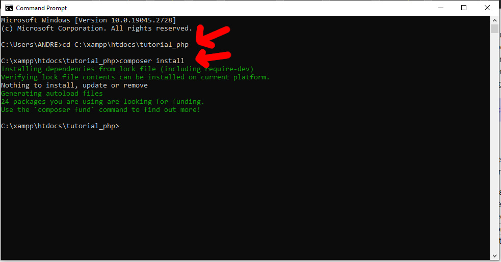

## 2. Instalação e configuração da IDE VsCode

0. Verifique se o VsCode esta instalado na sua maquina, clicando no menu "Iniciar" do Windows e digitando "vscode". Se ele aparecer no menu Iniciar (vide printscreen abaixo), ele esta instalado na maquina. Do contrario, prossiga com a instalação no passo **1.** abaixo.

    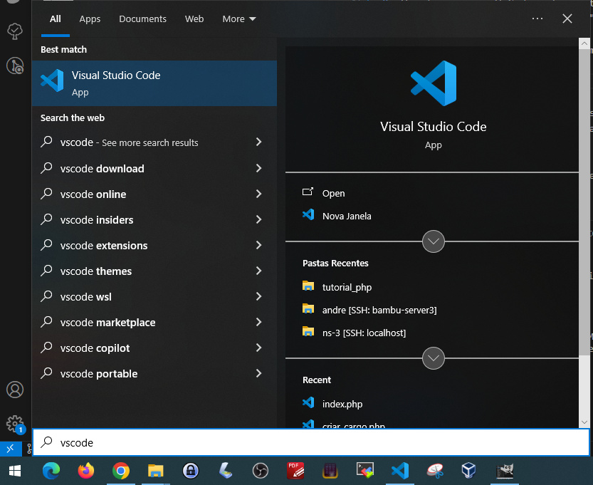

1. Caso o VsCode não esteja instalado, baixe e instale ele no seu usuario atraves do link **<a target="_blank" href="https://code.visualstudio.com/docs/?dv=win64user">https://code.visualstudio.com/docs/?dv=win64user</a>**.  Iremos usar ele para programar com PHP / HTML / SQL.

2. Além disso, instale as extensões  **"PHP DocBlocker"** e **"PHP Intelephense"** no VsCode (vide printscreen abaixo) para que possamos manipular o PHP com maior facilidade.

    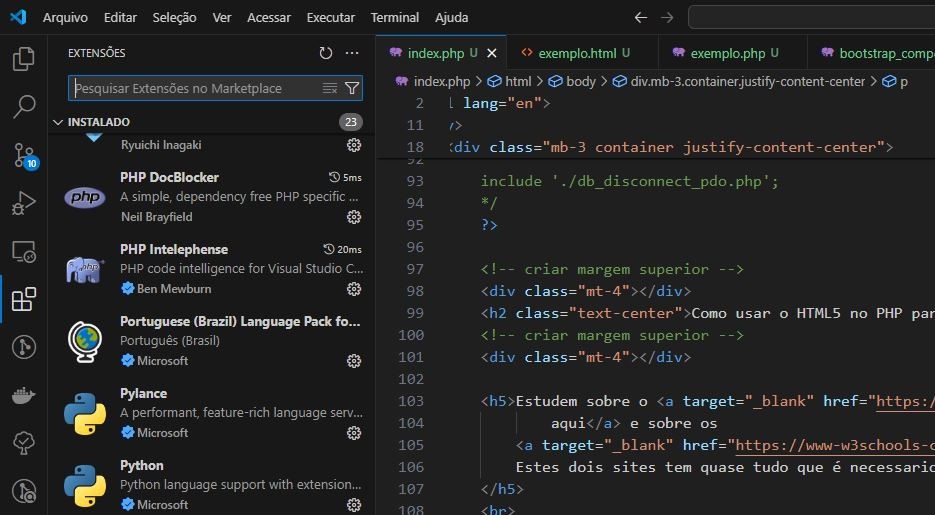

## 3. Iniciando os serviços do XAMPP (Apache e MySQL)

1. Inicie o XAMPP em sua maquina, seguindo os passos abaixo. Primeiro, clique no botão "Iniciar" do Windows e abra o "Painel de Controle do XAMPP" (printscreen abaixo)

    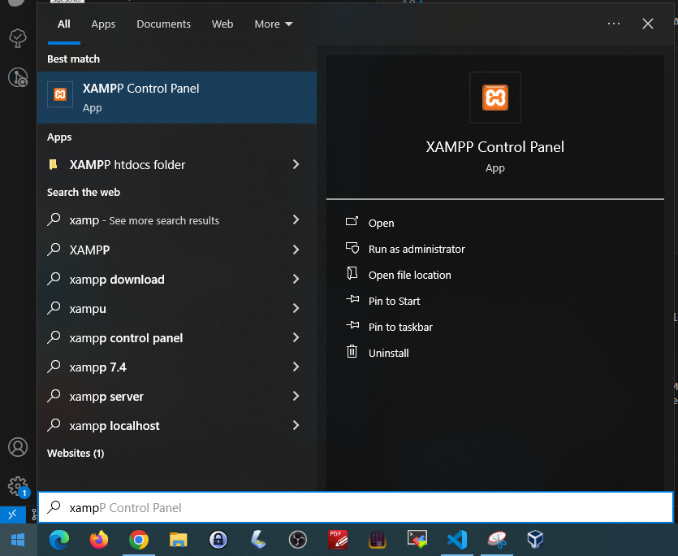

2. Inicie o Apache e o MySQL clicando nos botões  "Start" (vide printscreen abaixo)

    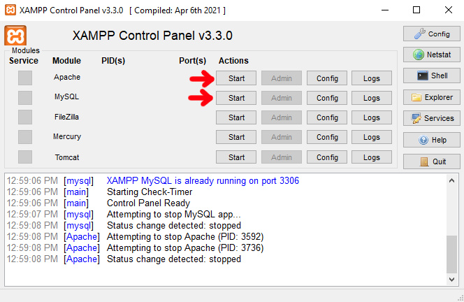

> - A partir desse momento voce ja deve ser capaz de acessar o PHPMyAdmin através do link **<a target="_blank" href="http://localhost/phpmyadmin">http://localhost/phpmyadmin</a>**

## 4. Criando um projeto dentro do servidor Apache do XAMPP

1. Para criar outros projetos com PHP / MySQL no XAMPP, basta criar uma pasta **"C:\xampp\htdocs\NOME_DO_PROJETO"** e acessar seu conteudo em **<a target="_blank" href="http://localhost/NOME_DO_PROJETO">http://localhost/NOME_DO_PROJETO</a>** no navegador.

2. Iremos criar o projeto **"tutorial_php"** no XAMPP. Para isso, crie a pasta **"C:\xampp\htdocs\tutorial_php"**. Copie todos os arquivos deste repositório Git para a pasta.
    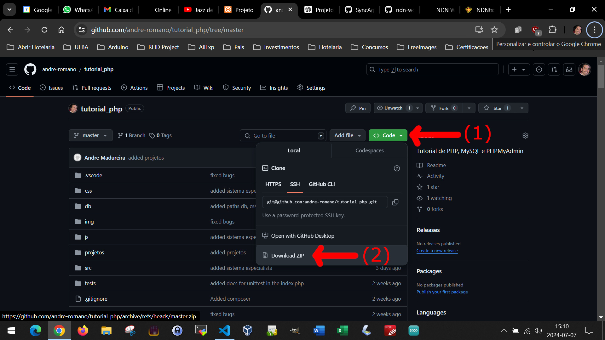


    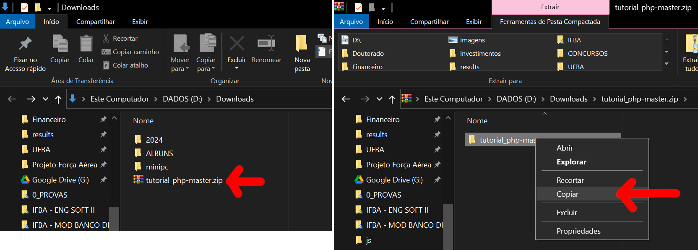


    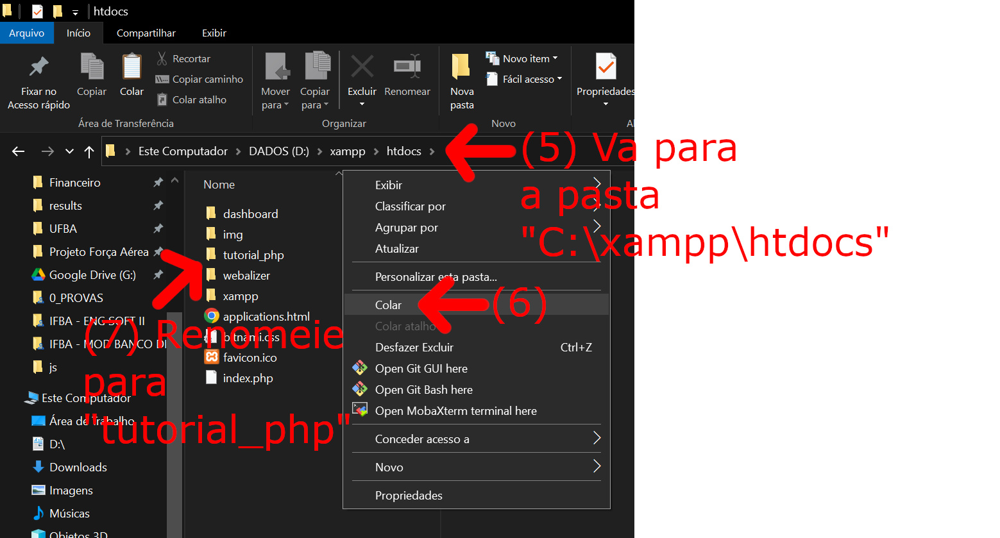

> - A partir desse momento voce deve ser capaz de acessar os arquivos PHP através do link **<a target="_blank" href="http://localhost/tutorial_php">http://localhost/tutorial_php</a>** no navegador. Acesse esse link para ter mais detalhes de como conduzir esse projeto.
