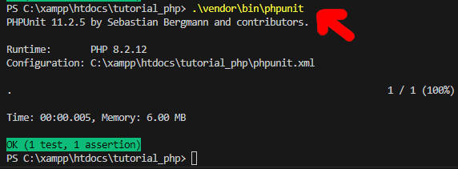

# Pasta tests

Os arquivos colocados dentro desta pasta serao processados pelo PHPUnit como sendo arquivos de testes unitarios (*unittests*).

O nome dos arquivos deve estar no formato **classeQueQueremosTestarTest.php**

Dentro desse arquivo **./tests/classeQueQueremosTestarTest.php** voce deve ter o seguinte:

```php
require_once __DIR__ . '/../src/classeQueQueremosTestar.php'

use PHPUnit\Framework\TestCase;

class ClasseQueQueremosTestarTest extends TestCase
{
    public function testNomeDoTesteAqui()
    {
        $myClass = new ClasseQueQueremosTestar();

        // funcao que queremos testar aqui
        $result = $myClass->concatenateStrings('hello', 'world');
        
        // resultado esperado da funcao que queremos testar
        $expectedResult = 'helloworld';

        $this->assertEquals($expectedResult, $result);
    }
}
```

Para executar os todos testes definidos dentro desta pasta, execute o comando abaixo dentro da pasta raiz deste projeto ( `C:\xampp\htdocs\tutorial_php` ):
```cmd
.\vendor\bin\phpunit
```

Se tudo funcionar sem nenhum problema voce deverá ver algo como:


  